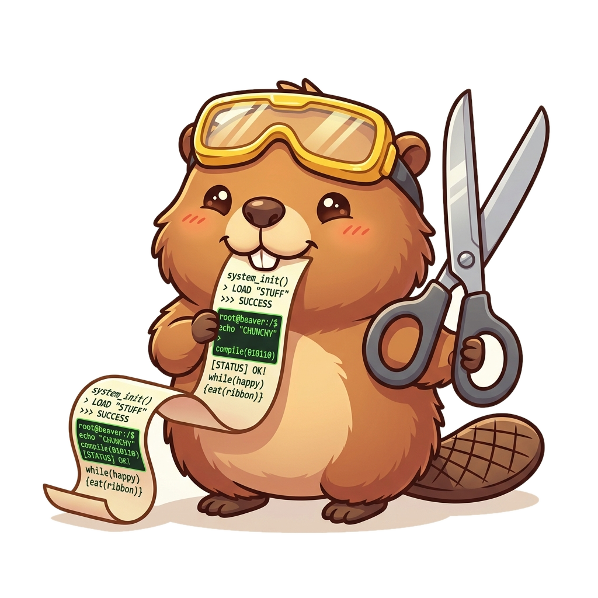

# asciicut

### See what you cut — a visual editor for terminal recordings

<p align="center">
  
</p>

You recorded your terminal with [asciinema](https://asciinema.org), and most of
it is waiting — a spinner turning, a build compiling, nothing to watch. **asciicut**
lets you *see* where that dead air is and cut it out, so a 17‑minute recording
becomes a tight 40‑second clip you'd actually want to share.

No guessing timestamps. No blind `cut --start 60 --end 470`. You watch the
recording and cut it by looking.

---

## What you can do

- 📉 **Spot the dead air instantly** — an activity timeline draws your recording as
  a waveform. The quiet stretches are flat valleys you can see at a glance.
- ✂️ **Cut by looking** — a filmstrip of real frames runs along the timeline, so
  you trim against what's actually on screen, not against seconds you guessed.
- ⏩ **Pace it like an edit** — keep the good parts, fast‑forward the waiting, and
  hold on the final frame. Each piece gets its own speed and freeze.
- ▶️ **Preview as you go** — the composed cut plays live while you edit.
- 📦 **Export anywhere** — save as a trimmed `.cast`, or an **MP4 / WebM / GIF**.
  The video tools are bundled — nothing extra to install.

Your original recording is never changed. Every edit is just a set of
instructions layered on top, so you can retrim, reorder, and undo freely.

---

## Install

### Download (recommended)

Grab the installer for your system from the
**[latest release](https://github.com/Entelligentsia/asciicut/releases/latest)**:

| Platform | File |
|----------|------|
| **macOS** | `.dmg` |
| **Windows** | `.msi` or `.exe` |
| **Linux** | `.AppImage` or `.deb` |

> Installers are being published — if the Releases page is empty, they're on the
> way. In the meantime, [build it yourself](#build-it-yourself); it's a few commands.

**First launch:** the app isn't code‑signed yet, so your OS may warn you the
first time (macOS: right‑click → **Open**; Windows: **More info → Run anyway**).
Full per‑platform steps: [`OPENING_UNSIGNED.md`](crates/asciicut-desktop/OPENING_UNSIGNED.md).

### Build it yourself

You'll need [Rust](https://rustup.rs), [Node.js](https://nodejs.org) 18+, and on
**Linux** the WebKitGTK 4.1 + GTK 3 dev packages. Then:

```sh
# one-time: add the wasm target + fetch the bundled agg/ffmpeg tools
rustup target add wasm32-unknown-unknown
(cd crates/asciicut-desktop && ./sidecars/fetch-sidecars.sh)

# run the desktop app
cd web
npm install
npm run tauri dev        # launch it
npm run tauri build      # or build an installer for your platform
```

Full prerequisites and packaging notes:
[`crates/asciicut-desktop/BUILD.md`](crates/asciicut-desktop/BUILD.md).

---

## How to use it

1. **Open a recording.** Launch asciicut and choose **File → Open** (`Ctrl/Cmd+O`),
   then pick a `.cast` file. (New to asciinema? Record one with
   `asciinema rec demo.cast`.)
2. **Find the dead air.** The activity timeline shows your recording as a
   waveform — busy moments spike, waiting goes flat. That's where to cut.
3. **Mark what to keep.** Drag on the timeline to draw a segment, or drag a
   segment's edges to trim it. Keep only the parts worth watching.
4. **Set the pace.** Select a segment and give it a **speed** (fast‑forward the
   boring bits) and a **hold** (freeze on a frame so a result lands before you
   move on).
5. **Watch it back.** The preview plays your composed cut live as you tweak.
6. **Export.** Hit **Export cut** and choose `.cast`, MP4, WebM, or GIF. Done.

That's the whole loop: **see → cut → pace → export.**

---

## Prefer the terminal?

asciicut is one binary that's also a CLI and a local web app.

```sh
asciicut recording.cast                     # opens the editor in your browser
asciicut compose recording.asciicut.json > cut.cast   # headless, scriptable
```

Build the binary with `cargo build --release`; it lands at `target/release/asciicut`.
The GUI, the browser editor, and the command line all use the same engine, so a
cut composed one way is byte‑for‑byte identical to any other.

---

## Meet Nibbles


**Nibbles the beaver** — safety goggles on, scissors ready — is asciicut's mascot,
and pops up around the app: the header, the welcome screen, empty states, and the
export screen. The full brand kit lives in [`assets/`](assets/README.md).

---

## Under the hood

asciicut is built on a single Rust engine (compiled native for the app and to
WebAssembly for the browser) wrapped in a [Tauri](https://tauri.app) desktop
shell and a [SolidJS](https://www.solidjs.com) interface, with
[avt](https://github.com/asciinema/avt), [agg](https://github.com/asciinema/agg),
and ffmpeg doing the terminal‑emulation and video work. Curious about the design,
the roadmap, or the planned agent interface? It's all in **[`SPEC.md`](SPEC.md)**.

## License

MIT © Entelligentsia
